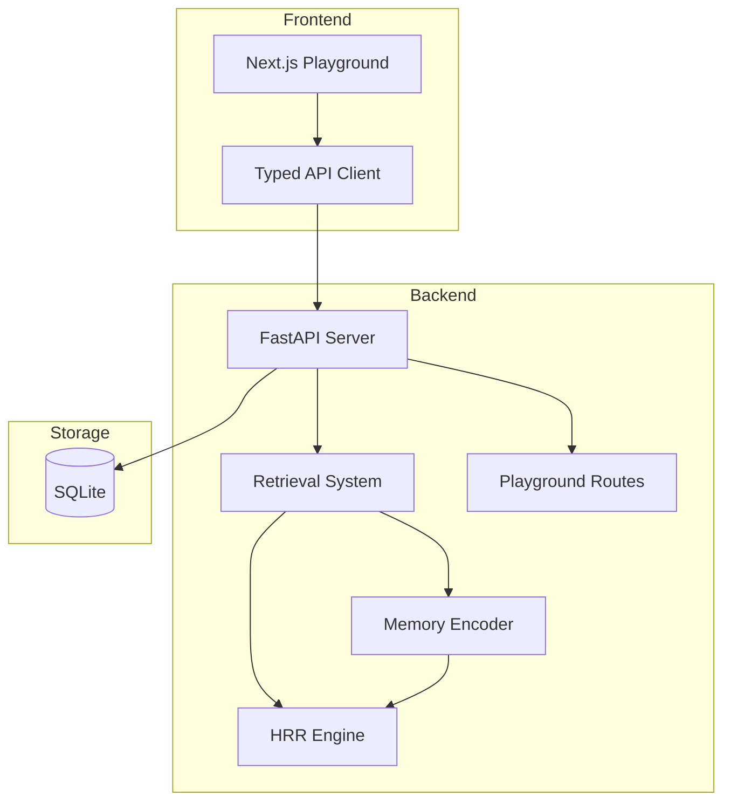

# HoloMemory

A working explainer for **Holographic Reduced Representations (HRR)**: a way to store structured information (like "Sarah owns the auth service") inside a single fixed-size vector. You add facts by binding role to value, then pull any one of them back out by asking with a key. No model, no embeddings, no API. Every demo runs the real math in the browser.

The site is structured around the four HRR operations (bind, superpose, unbind, cleanup) and a small applied example showing what they enable: a memory system with role-aware retrieval and source trust.


## What's here

- **HRR Lab**: four interactives that exercise the operations only HRR provides. Recover a stored value by name (`unbind` + `cleanup`), tell role-aware memories apart when keyword scoring can't, measure how many facts fit in one 1024-d vector before recall starts losing them, and watch HRR degrade smoothly under noise where a keyword index would fall off a cliff.
- **Applied example**: a small memory system that uses HRR underneath, plus a stemmed keyword index for literal matches and a per-memory trust score that breaks ties when sources disagree.
- **Playground**: sandbox for both. Teach facts, query, inject noise, create contradictions, watch the memory field react.
- **Parity**: identical Python and TypeScript implementations of the algebra, verified by `scripts/parity_check.mjs` so the live JS demo matches the FastAPI backend bit-for-bit.

## What it isn't

Not a competitor to RAG, vector DBs, or production embedding stacks. HRR has no semantic generalization (`editor` and `IDE` are uncorrelated symbol vectors) and capacity is finite (~50 structured facts cleanly in 1024 dimensions). It's an unusual, principled point in the design space, and this site shows what it can do.

## Test coverage

- **36 Python tests** covering HRR primitives, the four lab algorithms (chained unbind, role-filler distinction, capacity sweep, noise tolerance), retrieval strategies, and the FastAPI surface.
- **TypeScript HRR engine** type-checked end-to-end (`npx tsc --noEmit`).
- **Tokenizer parity**: Snowball English (PyStemmer ↔ snowball-stemmers) byte-identical across a 20-string corpus.

## Architecture



## How holographic memory works

Each concept becomes a deterministic high-dimensional vector (1024 dimensions). Structured relationships are encoded using three operations:

1. **Binding** (circular convolution via FFT): Associates two concepts. `bind(ROLE_SUBJECT, "user")` creates a vector representing "the subject is user."
2. **Superposition** (vector addition): Combines multiple bindings into a single trace. One vector stores all of a memory's associations.
3. **Unbinding** (circular correlation): Approximately recovers a value given a key. `unbind(trace, ROLE_SUBJECT)` recovers a noisy version of "user."
4. **Cleanup memory**: Maps noisy recovered vectors back to known symbols via cosine similarity.

Retrieval constructs a probe vector from the query and ranks stored traces by similarity.

## Features

- Memory CRUD with structured fields (subject, predicate, object, entities, tags, trust)
- Three retrieval modes: keyword baseline, holographic, and hybrid
- Explainable results with component score breakdowns
- Interactive playground with teach, recall, duel, and distortion sections
- Force-directed SVG memory field visualization with glow/pulse animations
- Curated demo scenario (Maya/Atlas) with one-click seeding
- Noise injection and contradiction generation for stress-testing
- Synthetic benchmarking comparing retrieval strategies

## Quickstart

> **Note on the live demo.** The deployment at
> [holomemory.vercel.app](https://holomemory.vercel.app) is pure client-side:
> the FastAPI backend is *not* hosted there. Instead, `frontend/lib/hrr/` is a
> TypeScript reimplementation of the same algebra and retrieval rules. The two
> implementations are kept in lockstep: `scripts/dump_tokens.py` and
> `scripts/parity_check.mjs` verify tokenizer parity, and `backend/tests/`
> covers the Python side. To exercise the full stack locally, follow the steps
> below.

### Prerequisites

- Python 3.11+
- Node.js 20+

### Backend

```bash
cd backend
python3 -m venv .venv
source .venv/bin/activate
pip install -e ".[dev]"

# Start server (auto-creates tables on startup)
uvicorn app.main:app --reload --port 8000
```

### Frontend

```bash
cd frontend
npm install
npm run dev
```

Open http://localhost:3000

### Both at once

```bash
chmod +x scripts/dev.sh
./scripts/dev.sh
```

## Screenshots

The homepage opens with the algebra visible: a fact decomposes into roles, each role binds into a deterministic amplitude strip, the three superpose into one 1024-dimensional trace, and a probe recovers the answer.


The full page walks the reader from "what is this" through encode, recall, trust-aware ranking, and an honest comparison with RAG, vector DBs, and keyword search.

<details>
<summary>Full page · desktop (long)</summary>


</details>

On narrow viewports the hero text leads, the diagram follows, and every section stacks without clipping.

<table>
<tr>
<td width="50%"></td>
<td width="50%"></td>
</tr>
<tr>
<td align="center"><sub>Mobile hero · 390×844</sub></td>
<td align="center"><sub>Playground · backend running shows live memory field</sub></td>
</tr>
</table>

<details>
<summary>Mobile · full page</summary>


</details>

Regenerate any time with the dev server running:

```bash
cd frontend && npm run dev          # in one terminal
node scripts/screenshot.mjs         # in another, from the repo root
```

## Frontend walkthrough

| Route | What's there |
|---|---|
| `/` | HRR explainer. Hero, the four operations, algebra, the canonical unbind demo, an applied example (encode/recall/trust), and an honest comparison with RAG, vector DBs, and keyword search. |
| `/playground` | HRR Lab (four interactives), then the memory playground: teach facts, inspect the memory field, recall, recall duel, distortion lab. |
| `/experiments` | Synthetic benchmark runs comparing keyword, holographic, and hybrid retrieval. |
| `/memories` | Browse, filter, and inspect stored memories. |
| `/about` | Technical explainer for engineers who want the details. |

## API examples

```bash
# Health check
curl http://localhost:8000/health

# Seed the demo scenario
curl -X POST http://localhost:8000/demo/seed

# Get memory field (all memories + edges)
curl http://localhost:8000/memory/field

# Create a memory
curl -X POST http://localhost:8000/memories \
  -H "Content-Type: application/json" \
  -d '{"text": "The user prefers dark mode.", "kind": "preference", "trust": 0.9}'

# Query with hybrid retrieval
curl -X POST http://localhost:8000/query \
  -H "Content-Type: application/json" \
  -d '{"query": "What does the user prefer?", "mode": "hybrid", "top_k": 5}'

# Duel: compare keyword vs holographic
curl -X POST http://localhost:8000/memory/duel \
  -H "Content-Type: application/json" \
  -d '{"query": "What does Maya prefer?", "top_k": 5}'

# Inject noise
curl -X POST http://localhost:8000/memory/noise \
  -H "Content-Type: application/json" \
  -d '{"count": 3}'

# Get stats
curl http://localhost:8000/stats
```

## Experiments

The benchmark runs synthetic queries against all active memories and measures:

- **Recall@1/3/5**: Whether the expected memory appears in top results
- **Average latency**: Time per query in milliseconds

Typical results with seed data:
- Keyword: high recall for exact token matches, fast
- Holographic: captures semantic structure, slightly lower recall on exact matches
- Hybrid: best overall by combining signals

## Engineering tradeoffs

| Decision | Rationale |
|----------|-----------|
| NumPy over ML embeddings | No external API dependency, deterministic, educational |
| SQLite over Postgres | Local-first, zero config, portable |
| 1024 dimensions | Balance between expressiveness and speed |
| FFT-based convolution | O(n log n) vs O(n^2) for direct convolution |
| SVG over Canvas | Small dataset (<200 nodes), Framer Motion integration, accessible DOM |
| Client-side force layout | Viewport-dependent, animatable, no new dependency |
| Soft delete | Preserves history, supports status lifecycle |
| Hybrid scoring weights | 40/30/15/15 chosen empirically, tunable |

## Limitations

- Not production-scale: linear scan over all vectors (no ANN index)
- Simple tokenizer: no lemmatization or semantic understanding
- No LLM-based entity extraction: relies on manual or rule-based fields
- Holographic retrieval is approximate by design, not exact lookup
- Single-user, single-process SQLite

## Future work

- Temporal decay and memory consolidation
- LLM-assisted entity extraction for richer encoding
- Hierarchical memory (episodic vs semantic)
- Approximate nearest neighbor indexing (FAISS/Annoy)
- Multi-agent memory sharing
- Forgetting curves and active memory management
