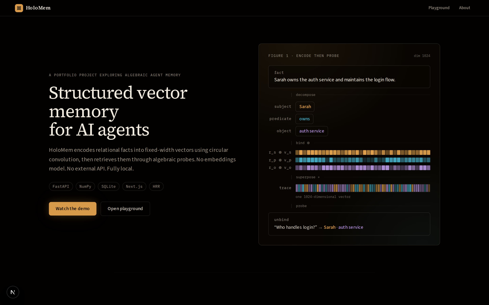
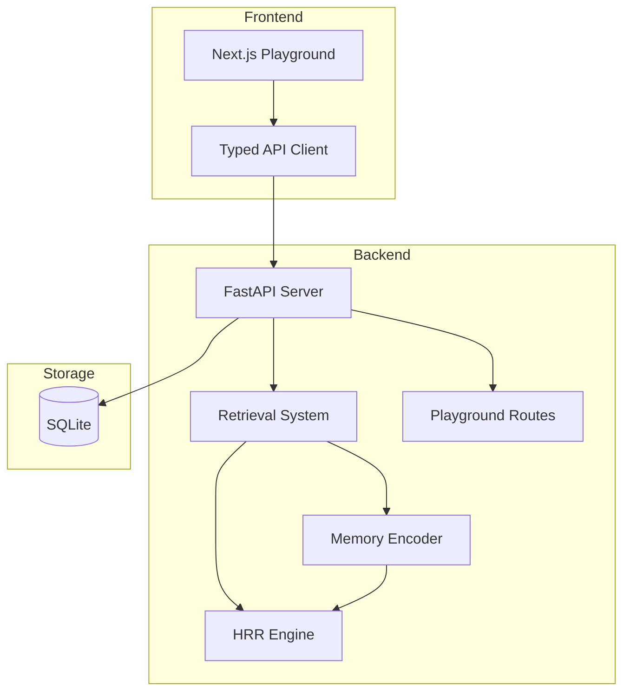
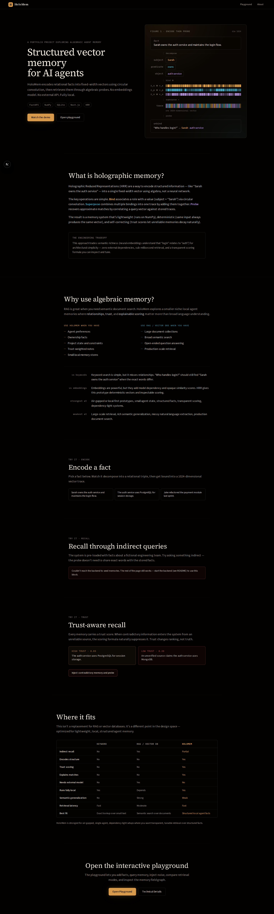
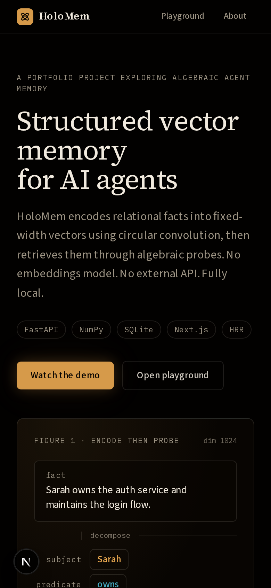
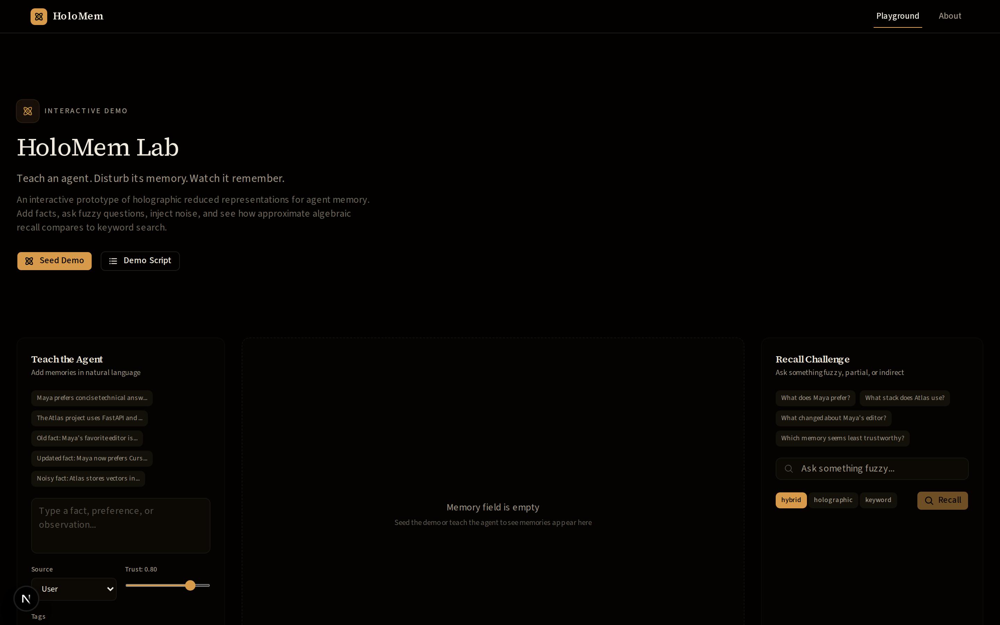

# HoloMemory

A local-first agent memory lab that implements HRR-style vector-symbolic memory with FastAPI, SQLite, NumPy, and an interactive Next.js playground.



## Why this exists

AI agents need memory systems that go beyond simple key-value stores or embedding-based RAG. HoloMemory demonstrates how structured memories can be encoded into high-dimensional vector traces using algebraic operations, then retrieved approximately — without requiring external ML models or paid APIs.

This is a portfolio project that makes AI infrastructure thinking visible: vector-symbolic architectures, retrieval system design, full-stack engineering, and technical communication.

## What it demonstrates

- HRR-style holographic memory encoding (binding, superposition, unbinding)
- Three retrieval strategies with explainable scoring (keyword, holographic, hybrid)
- Structured memory records with trust scores, entities, and status lifecycle
- Interactive playground: teach facts, query fuzzy questions, inject noise, create contradictions
- Side-by-side retrieval mode comparison (Recall Duel)
- Force-directed memory field visualization
- FastAPI backend with comprehensive test coverage (27 tests)
- No external LLM or embedding API dependencies

## Architecture



## How holographic memory works

Each concept becomes a deterministic high-dimensional vector (1024 dimensions). Structured relationships are encoded using three operations:

1. **Binding** (circular convolution via FFT): Associates two concepts. `bind(ROLE_SUBJECT, "user")` creates a vector representing "the subject is user."
2. **Superposition** (vector addition): Combines multiple bindings into a single trace. One vector stores all of a memory's associations.
3. **Unbinding** (circular correlation): Approximately recovers a value given a key. `unbind(trace, ROLE_SUBJECT)` recovers a noisy version of "user."
4. **Cleanup memory**: Maps noisy recovered vectors back to known symbols via cosine similarity.

Retrieval constructs a probe vector from the query and ranks stored traces by similarity.

## Features

- Memory CRUD with structured fields (subject, predicate, object, entities, tags, trust)
- Three retrieval modes: keyword baseline, holographic, and hybrid
- Explainable results with component score breakdowns
- Interactive playground with teach, recall, duel, and distortion sections
- Force-directed SVG memory field visualization with glow/pulse animations
- Curated demo scenario (Maya/Atlas) with one-click seeding
- Noise injection and contradiction generation for stress-testing
- Synthetic benchmarking comparing retrieval strategies

## Quickstart

### Prerequisites

- Python 3.11+
- Node.js 20+

### Backend

```bash
cd backend
python3 -m venv .venv
source .venv/bin/activate
pip install -e ".[dev]"

# Start server (auto-creates tables on startup)
uvicorn app.main:app --reload --port 8000
```

### Frontend

```bash
cd frontend
npm install
npm run dev
```

Open http://localhost:3000

### Both at once

```bash
chmod +x scripts/dev.sh
./scripts/dev.sh
```

## Screenshots

The homepage opens with the algebra visible: a fact decomposes into roles, each role binds into a deterministic amplitude strip, the three superpose into one 1024-dimensional trace, and a probe recovers the answer.


The full page walks the reader from "what is this" through encode, recall, trust-aware ranking, and an honest comparison with RAG, vector DBs, and keyword search.

<details>
<summary>Full page · desktop (long)</summary>



</details>

On narrow viewports the hero text leads, the diagram follows, and every section stacks without clipping.

<table>
<tr>
<td width="50%"></td>
<td width="50%"></td>
</tr>
<tr>
<td align="center"><sub>Mobile hero · 390×844</sub></td>
<td align="center"><sub>Playground · backend running shows live memory field</sub></td>
</tr>
</table>

<details>
<summary>Mobile · full page</summary>


</details>

Regenerate any time with the dev server running:

```bash
cd frontend && npm run dev          # in one terminal
node scripts/screenshot.mjs         # in another, from the repo root
```

## Frontend walkthrough

| Section | Purpose |
|---------|---------|
| Playground (/) | Interactive lab: teach facts, visualize memory field, query with fuzzy recall |
| Recall Duel | Side-by-side keyword vs holographic comparison |
| Distortion Lab | Inject noise, create contradictions, reset — stress-test the system |
| How It Works | Step-through explainer of bind/superpose/unbind |
| Experiments | Run benchmarks comparing retrieval strategies |
| Memories | Browse, filter, inspect memories |
| About | Technical explainer for engineers |

## API examples

```bash
# Health check
curl http://localhost:8000/health

# Seed the demo scenario
curl -X POST http://localhost:8000/demo/seed

# Get memory field (all memories + edges)
curl http://localhost:8000/memory/field

# Create a memory
curl -X POST http://localhost:8000/memories \
  -H "Content-Type: application/json" \
  -d '{"text": "The user prefers dark mode.", "kind": "preference", "trust": 0.9}'

# Query with hybrid retrieval
curl -X POST http://localhost:8000/query \
  -H "Content-Type: application/json" \
  -d '{"query": "What does the user prefer?", "mode": "hybrid", "top_k": 5}'

# Duel: compare keyword vs holographic
curl -X POST http://localhost:8000/memory/duel \
  -H "Content-Type: application/json" \
  -d '{"query": "What does Maya prefer?", "top_k": 5}'

# Inject noise
curl -X POST http://localhost:8000/memory/noise \
  -H "Content-Type: application/json" \
  -d '{"count": 3}'

# Get stats
curl http://localhost:8000/stats
```

## Experiments

The benchmark runs synthetic queries against all active memories and measures:

- **Recall@1/3/5**: Whether the expected memory appears in top results
- **Average latency**: Time per query in milliseconds

Typical results with seed data:
- Keyword: high recall for exact token matches, fast
- Holographic: captures semantic structure, slightly lower recall on exact matches
- Hybrid: best overall by combining signals

## Engineering tradeoffs

| Decision | Rationale |
|----------|-----------|
| NumPy over ML embeddings | No external API dependency, deterministic, educational |
| SQLite over Postgres | Local-first, zero config, portable |
| 1024 dimensions | Balance between expressiveness and speed |
| FFT-based convolution | O(n log n) vs O(n^2) for direct convolution |
| SVG over Canvas | Small dataset (<200 nodes), Framer Motion integration, accessible DOM |
| Client-side force layout | Viewport-dependent, animatable, no new dependency |
| Soft delete | Preserves history, supports status lifecycle |
| Hybrid scoring weights | 40/30/15/15 chosen empirically, tunable |

## Limitations

- Not production-scale: linear scan over all vectors (no ANN index)
- Simple tokenizer: no lemmatization or semantic understanding
- No LLM-based entity extraction: relies on manual or rule-based fields
- Holographic retrieval is approximate by design — not exact lookup
- Single-user, single-process SQLite

## Future work

- Temporal decay and memory consolidation
- LLM-assisted entity extraction for richer encoding
- Hierarchical memory (episodic vs semantic)
- Approximate nearest neighbor indexing (FAISS/Annoy)
- Multi-agent memory sharing
- Forgetting curves and active memory management
